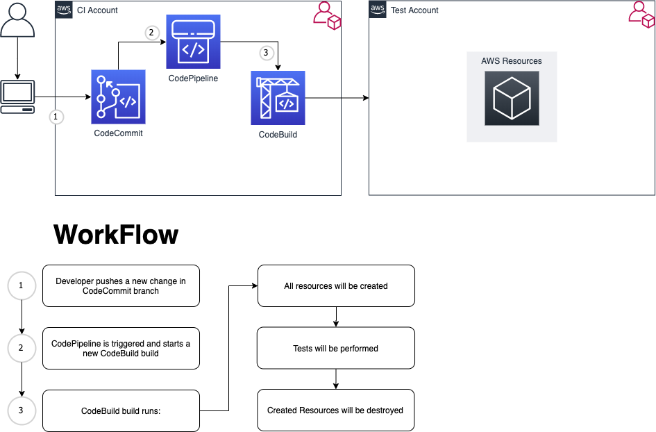

## ci-4-terraform-aws-developer-tools-terratest

# Table of Contents
- [Table of Contents](#table-of-contents)
- [Introduction](#introduction)
  - [Scope of the artifact:](#scope-of-the-artifact)
  - [Target Audience](#target-audience)
  - [UseCase](#usecase)
  - [Architecture](#architecture)
- [Repository Structure](#repository-structure)
  - [`/terraform`](#terraform)
    - [`/terraform/examples`](#terraformexamples)
    - [`/terraform/modules`](#terraformmodules)
- [Guide](#guide)
  - [Prerequisites](#prerequisites)
  - [1. Deploy CI Pipeline.](#1-deploy-ci-pipeline)
  - [2. Review and tune the test code](#2-review-and-tune-the-test-code)
  - [3. Push the code inside your new CodeCommit repository.](#3-push-the-code-inside-your-new-codecommit-repository)
  - [4. Clean Up](#4-clean-up)
  - [Troubleshooting](#troubleshooting)
    - [Error deleting S3 Bucket (BucketNotEmpty)](#error-deleting-s3-bucket-bucketnotempty)
  - [Security](#security)
  - [License](#license)

# Introduction

[Terraform](https://www.terraform.io/) is widely used among customers to provision and manage infrastructure and services on AWS. <br>
A Terraform module is a container for multiple resources that are used together. Modules can, and should be used to create lightweight
abstractions, so that you can describe your infrastructure in terms of its architecture, rather than directly in terms of
physical objects. <br>


## Scope of the artifact:

In order to provide high quality and reliable modules each of these modules should be tested.

Due to the nature of the Infrastructure as Code automated tests on the described resources have been always complicated often forcing the developers to perform manual tests on their solutions after the deployment.

The module presented in this repository contains code to deploy Continuous Integration (CI) solution based on CodePipeline, CodeBuild and [Terratest](https://terratest.gruntwork.io/) library, offering the ability to run E2E tests on Terraform modules in an automated way.

## Target Audience

The main target audience for this artifact are Infrastructure as Code developers with experience with Terraform.

For simple basic tests no experience with `golang` is required.

## UseCase

This artifact is build out of our experience in many projects when Terraform is used as main IaC tool.

We observed on the customer side an increment of the demand of re-usable modules across teams and projects.

As a consequence the customers are requiring high quality and reliable Terraform code.
Moreover in such scenarios those modules are continuously developed.

Automated E2E tests becomes then necessary to ensure the delivery of new feature, ensure the stability of the system and enforce high standards.

## Architecture

The following architecture diagram simplifies the proposed solution. Note that an independent account is used to run the mentioned E2E
tests based on the provided Terraform modules.




# Repository Structure

```bash
.
|-- README.md
`-- terraform
    |-- examples
    `-- modules

```

## `/terraform`

This directory contains:
- `./examples`: reusable examples for the modules.
- `./modules`: Terraform modules for the CI pipeline, including the `CodeBuild` build scripts.

The content of the repository is structured providing reusable Terraform modules.
These modules and their content can be extracted and reused.

### `/terraform/examples`

It is a good practice when releasing modules to provide also working examples.

Those examples can be stored in a dedicated directory at the same level of the modules directory.

In this repository the example [`cicd_account`](./terraform/examples/cicd_account/main.tf)  is provided. It uses the module located in `/terraform/modules/cicd`
. This example will deliver a CI based on `CodePipeline`, `CodeBuild` and `CodeCommit` and uses this same repository as source.

The proposed behavior can be changed and adapted to the specific needs.

### `/terraform/modules`

This directory contains the *Terraform* modules, the tests and the code run by `CodeBuild`.

Information about `CodeBuild` and how to interpret the `buildspec.yaml` file can be found
[here](https://docs.aws.amazon.com/codebuild/latest/userguide/build-spec-ref.html).
It is not in the scope of this document to explain it.

CodeBuild workflow:

1. Runs the tests described in `modules/cicd/test`
2. For each run the test reports can be accessed via AWS CodeBuild Console under `Reports` tab.

# Guide

## Prerequisites

The following prerequisites are necessary in order to run the example.

- [Terraform version >= 12](https://learn.hashicorp.com/tutorials/terraform/install-cli)
- [aws cli v2](https://docs.aws.amazon.com/cli/latest/userguide/install-cliv2.html)
- [python >= 3.8](https://www.python.org/downloads/)
- [go >= 1.15.2](https://golang.org/doc/install)
- [terratest](https://terratest.gruntwork.io/)

## 1. Deploy CI Pipeline.

Using the provided code example the CI pipeline can be deployed. One has the choice of deploying the cross account setup,
where the CI runs on one AWS account and the tests are performed on another AWS account.  For the sake of simplicity this
guide walks you through setting up the solution within a single AWS account.

To deploy the CI follow the these steps:
1. Modify the [terraform/examples/cicd_account/inventories/variables.tfvars](./terraform/examples/cicd_account/inventories/variables.tfvars)
  accordingly with your needs. A list of all the available variables with a short description of their scope can be found [terraform/examples/cicd_account/variables.tf](./terraform/examples/cicd_account/variables.tf)
2. Configure your AWS CLI, [here](https://docs.aws.amazon.com/cli/latest/userguide/cli-chap-configure.html) for more information
3. Deploy the resources:

    ```sh
    cd terraform/examples
    ./run_terraform.sh
    ```

    and follow the instructions provided.

In case of errors look at the [Troubleshooting](#troubleshooting) section.

The [README.md](./terraform/modules/cicd/README.md) inside the module provides information about the resources provisioned

## 2. Review and tune the test code

A test example called [cicd_test.go](./terraform/modules/cicd/test/cicd_test.go) is found inside the module directory. It
can be tuned to meet the desired requirements.

A complete guide can be found in the [README.md](./terraform/modules/cicd/README.md) of the module.

## 3. Push the code inside your new CodeCommit repository.

For this test you can push the same code you are using right now.

1. This first step is optional, but it is recommended: create a `.gitignore` file in the root level of the repository
    to avoid git tracking Terraform state files.

    ```sh
    echo "*.tfstate*
    .terraform
    plan.out" >> .gitignore
    ```

2. Retrieve repository remote address:
    1. on the AWS console got in `CodeCommit`
    2. click on your repository name
    3. Click on `Clone URL` and select your preferred way (I would suggest `HTTPS (GRC)`).
       Documentation about how to set up it can be found by clicking on `connection steps`.

3. Setup your git repo:

    ```sh
    git remote add origin <THE_URL_YOU_GOT_ON_STEP2>
    ## By default the CodePipeline monitors the dev branch
    git checkout -b dev
    git push --set-upstream origin
    ```

4. Push the repo against the **dev** branch this will trigger the start of the Pipeline
5. Follow the Pipeline Run connecting to the `CodePipeline` console.

## 4. Clean Up

When you finished, in order to do not incur in extra costs, you should clean up your environment.

You can do that by running:

```sh
cd terraform/examples
./run_terraform.sh delete
```

The procedure will stop asking for confirming to have removed every object from the S3 bucket.

The names of the buckets are showned as output from the previous command.

```sh
# e.g.
CodeBuild_S3_bucket = "artifact-cicd-test-12345678910-codebuild"
CodePipeline_S3_bucket = "artifact-cicd-test-12345678910-codepipeline"
Confirm that you have empty the S3 bucket...
```

This procedure needs to be done manually, in order to do that:
1. Access to AWS Console and go to S3
2. Select the buckets and click on `Empty`

## Troubleshooting

### Error deleting S3 Bucket (BucketNotEmpty)

Terraform can exit with this error when you are cleaning or update a deployment.

The reason resides to the fact that Terraform is not able to remove a non-empty S3 bucket.

To fix the issue you need to manually remove the object in the bucket:
1. Access to AWS Console and go to S3
2. Select the failing bucket and click on `Empty`

## Security

See [CONTRIBUTING](CONTRIBUTING.md#security-issue-notifications) for more information.

## License

This library is licensed under the MIT-0 License. See the LICENSE file.
